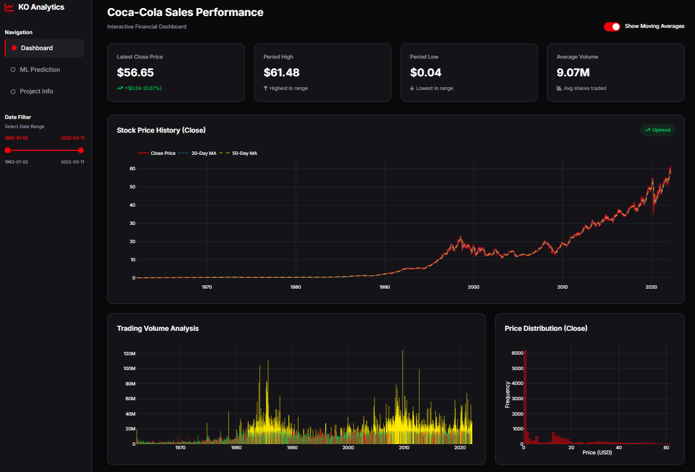
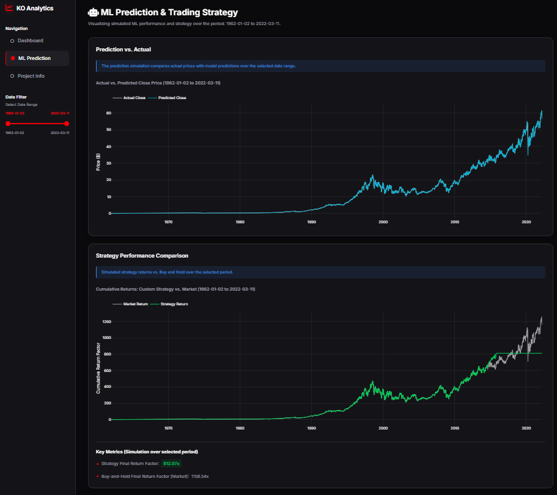
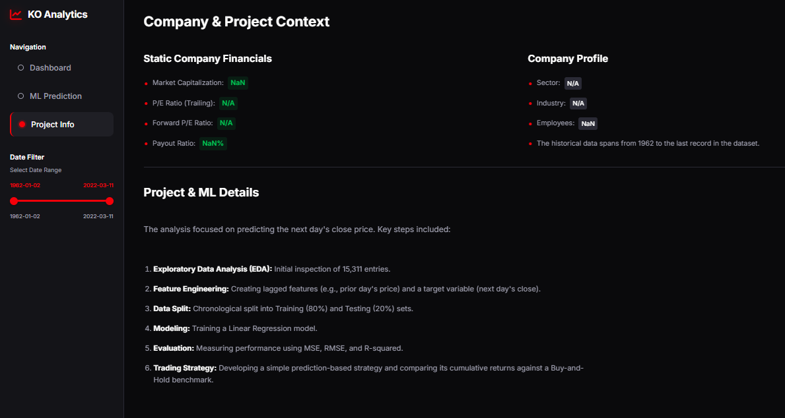

# 📈 Coca-Cola Stock Price Prediction System

<p align="center">
  
  
  
  
  
  
</p>

---

### *End-to-End Machine Learning Pipeline for Financial Forecasting & Market Signal Analysis*

> **A scalable and extensible analytics system designed to model, interpret, and predict stock price movements of Coca-Cola (KO) using time-series feature engineering and machine learning techniques.**

---

## 🚀 Project Overview

Financial markets generate massive volumes of time-series data, but raw price data alone does not reveal:

- Underlying trends and momentum  
- Volatility patterns  
- Predictive signals from historical behavior  
- Model-driven future price estimation  

This project transforms historical stock data into a **predictive intelligence system** using:

- Feature engineering  
- Statistical indicators  
- Machine learning models  

👉 Delivering a **data-driven approach to stock price forecasting and analysis**

---

## 🎯 Objectives

- Perform **exploratory time-series analysis (EDA)**  
- Engineer meaningful **lag-based and rolling features**  
- Train and compare **machine learning models**  
- Evaluate predictive performance using **robust metrics**  
- Build a **foundation for advanced financial forecasting systems**

---

## 📊 Sample Visualizations

### *📌 1️⃣ Sales Performance & Market Overview*
<p align="center">  </p>
Description:

> Displays overall Coca-Cola stock performance across the full historical timeline 

### Key KPIs
- Latest closing price
- Period high & low
- Average trading volume
- Includes:
   - 📈 Long-term price trend visualization
   - 📊 Moving averages (20-day & 50-day) for trend detection
   - 📉 Trading volume analysis to identify market activity spikes
   - 📦 Price distribution histogram to understand price frequency

* 👉 Provides a macro-level understanding of market behavior, trends, and volatility *
---

### *📌 2️⃣ ML Prediction & Trading Strategy*
<p align="center">  </p>
Description:

> - Compares actual vs predicted stock prices using machine learning models
> - Demonstrates:
>     - 📉 Model accuracy over time
>     - 📈 Ability to capture long-term trends

- Strategy Analysis:
   - Simulates a prediction-based trading strategy
   - Compares against:
       - 🟢 Model-driven strategy returns
       - ⚪ Buy-and-hold benchmark
         
### Key Insights:
- Evaluates model effectiveness in real-world trading scenarios
- Highlights cumulative returns and performance gaps

* 👉 Bridges the gap between prediction → actionable financial strategy*
---

### *📌 3️⃣ Project Context & Financial Insights*
<p align="center">  </p>
Description:

> - Provides contextual and structural understanding of the project
> - Sections include:
>     - 📊 Company Profile
>     - 🧠 ML Pipeline Summary

- 📊 Company Profile:
   - Sector, industry, and metadata placeholders
   - Dataset time coverage (1962–2022)

- 🧠 ML Pipeline Summary
  - End-to-end workflow:
    
    
    -  1. Exploratory Data Analysis
    -  2. Feature Engineering (lag features, returns)
    -  3. Train-test split (time-series aware)
    -  4. Model training (Linear Regression)
    -  5. Evaluation (RMSE, R²)
    -  6. Strategy simulation


* 👉 Acts as a documentation layer explaining methodology + assumptions*
---


## 🗂️ Dataset Description

### 📌 Data Sources

- `Coca-Cola_stock_history.csv`
  - Daily OHLCV data (Open, High, Low, Close, Volume)

- `Coca-Cola_stock_info.csv`
  - Company financial metadata (for future integration)

---

### 📌 Data Characteristics

- Time-series structured data  
- Daily frequency  
- Minimal missing values  
- Suitable for supervised learning after transformation  

---

## 🛠️ Tech Stack & Tools

| Category | Tools |
|------|------|
| Programming | Python |
| Data Processing | Pandas, NumPy |
| Visualization | Matplotlib, Seaborn |
| Machine Learning | Scikit-learn |
| Development | Jupyter Notebook |

---

## 🏗️ System Architecture

```text
Raw Stock Data
     ↓
Data Cleaning
     ↓
Feature Engineering
     ↓
Time-Series Transformation
     ↓
Model Training
     ↓
Evaluation (RMSE)
     ↓
Prediction & Insights
```

## 🔄 Methodology & Pipeline

### 1️⃣ Data Preprocessing
- Date parsing and indexing  
- Handling missing values  
- Sorting data chronologically  

---

### 2️⃣ Feature Engineering

Constructed predictive features from raw price signals:

| Feature | Description |
|--------|------------|
| `Close_Lag1` | Previous day closing price |
| `Daily_Return` | Percentage change in price |
| `Volatility` | 7-day rolling standard deviation |
| `MA20` | 20-day moving average |
| `MA50` | 50-day moving average |

👉 These features transform raw prices into:
- Trend indicators  
- Momentum signals  
- Risk/volatility measures  

---

### 3️⃣ Exploratory Data Analysis (EDA)

- Trend visualization of closing prices  
- Moving average crossover patterns  
- Volatility clustering analysis  
- Return distribution insights  

✔ Helps identify:
- Market trends  
- Noise vs signal  
- Temporal dependencies  

---

### 4️⃣ Modeling

#### 🔹 Linear Regression
- Baseline model  
- Captures linear relationships  

#### 🔹 Random Forest Regressor
- Ensemble-based model  
- Captures non-linear dependencies  
- Handles feature interactions effectively  

---

### 5️⃣ Evaluation

- Metric Used: **Root Mean Squared Error (RMSE)**  

| Model | Performance |
|------|------------|
| Linear Regression | Baseline |
| Random Forest | ✅ Better performance |

---

## 📊 Key Insights

- Stock prices show **strong temporal dependency**
- Moving averages capture **trend direction effectively**
- Volatility is **clustered, not random**
- Tree-based models outperform linear models in financial prediction  

---

## ⚠️ Assumptions & Limitations

- Based only on **historical price data**
- No macroeconomic or sentiment indicators included  
- Market behavior assumed to have learnable patterns  
- Predictions are **probabilistic, not guaranteed**

---

## 📈 Why This Project Matters

- Financial forecasting is complex and noisy  
- Demonstrates:
  - Time-series data handling  
  - Feature engineering expertise  
  - Practical ML model application  

👉 Bridges the gap between:  
**Raw financial data → Predictive intelligence**

---

## 🧩 Project Structure

```text
├── notebooks/
│   └── Coca_Cola_Project.ipynb
├── data/
│   ├── Coca-Cola_stock_history.csv
│   └── Coca-Cola_stock_info.csv
├── assets/
│   ├── price_trend.png
│   └── volatility_plot.png
├── README.md
```


### 💪 Strengths
- Strong feature engineering for time-series
- Scalable for advanced forecasting systems

---

### 🔮 Future Enhancements
- Deep learning models (LSTM / GRU)
- Integration of:
   - Macroeconomic indicators
   - News sentiment analysis
- Hyperparameter tuning

---

## 🎯 Key Takeaways

> **This project demonstrates how historical stock data can be transformed into a predictive modeling system using feature engineering and machine learning techniques.**

- Lag features capture temporal dependencies
- Rolling statistics encode trend and volatility
- Ensemble models improve prediction performance
- Financial data benefits from non-linear modeling approaches
---

## 🧠 Author
**Aditya Sharma**
Machine Learning Enthusiast | Data Science Explorer

---
⭐ If you found this project insightful, consider starring the repository.
---


